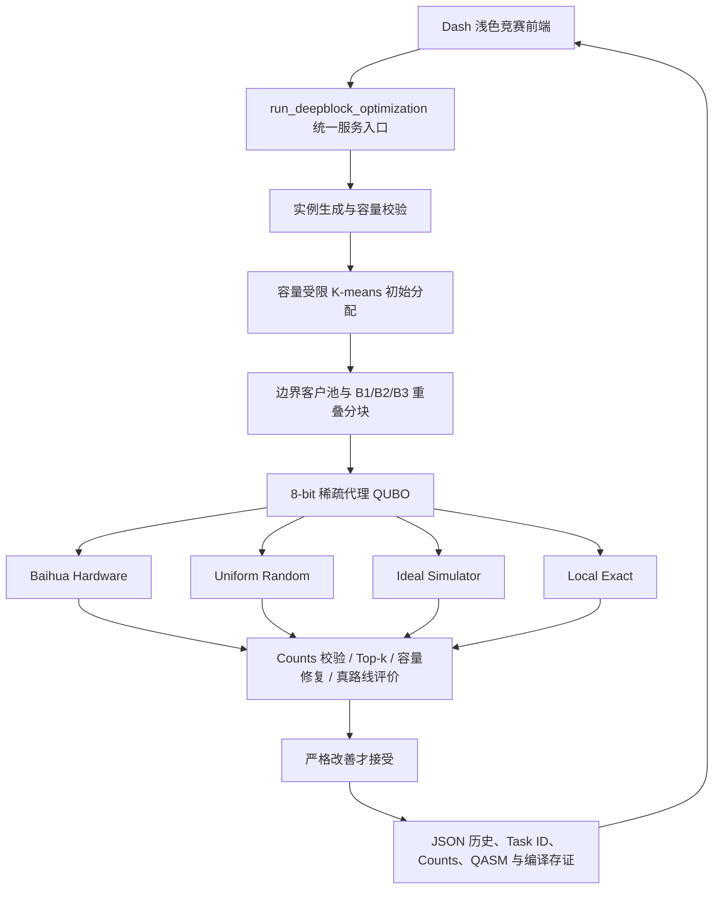

# Quantum Route Forge 融合版项目完整文档

> 当前分支：`competition/deepblock-ui-integration`
>
> 文档基线：本地融合提交 `7249803`
>
> 文档日期：2026-08-02
>
> 项目仓库：`LPZ-SY/kujinganlai-version`

## 摘要

Quantum Route Forge 是我围绕“量子候选生成如何真正进入车辆路径优化闭环”设计和实现的混合量子计算项目。我没有将量子处理器包装成能够单独求解完整车辆路径问题的“黑盒”，而是把它放在一个可审计的候选生成位置：真机负责在局部 QUBO 状态空间中产生 bitstring 分布，经典端负责容量修复、真实路线评价、严格接受与结果存证。

在当前分支中，我进一步完成了 Baihua DeepBlock 竞赛前端、容量受限初始聚类、B1/B2/B3 重叠分块、8-bit 稀疏代理 QUBO、Baihua 校准拓扑编译、Hardware/Random/Simulator/Exact 同条件对照、Top-k 真路线评价、历史记录和完整证据展示。我已实际提交 3 个 Baihua 真机任务，每个任务 4096 shots，全部返回完整 counts。

我对结果采取边界清晰的表达：当前三区块 Baihua 真机对“预定义最低 10% QUBO 能量区域”呈现了正向富集，平均命中率为 22.9574%，均匀随机基线为 10.1562%，富集倍数为 2.2604×；但这次局部搜索没有产生更短的真实路线，路线距离保持 90.8199。这说明“低代理能量富集”和“端到端路线改善”是两个不同层次的命题，我在项目中对二者分别评价，不做超出数据的量子优势宣称。

## 1. 项目定位

我将本仓库作为 Quantum Route Forge 的唯一项目主线。我在这条主线上持续完成了问题建模、量子测量接入、经典候选评价、多后端正式实验、DeepBlock 局部搜索、竞赛可视化和证据审计。当前分支不是一个孤立的算法脚本，而是一套能够从参数输入、真机提交、结果轮询、候选解码、路线验证一直走到历史证据重载的端到端系统。

我为项目设定了三个核心目标：

1. 我要让真实量子硬件的 counts 进入路线优化业务闭环，而不只是停留在电路演示层。
2. 我要在相同实例、相同状态空间和相同后处理规则下评价 Hardware、Random、Simulator 和 Exact；其中三种采样 arm 锁定相同 shots，Exact 明确作为全状态枚举参考。
3. 我要保留包括不利结果在内的完整证据，并且严格区分真机、模拟器、回放、手工输入和 fallback。

### 1.1 融合版本的组成

当前融合版不是重新开始的一套独立代码，而是在完成正式硬件实验的主线上继续加入 DeepBlock 算法和竞赛交互界面。它同时包含两类相互独立但共享底层基础设施的研究流程：

| 组成 | 主要内容 | 数据位置 | 在融合版中的作用 |
|---|---|---|---|
| 正式候选质量实验主线 | 4 个固定实例、3 个后端、2 次重复，共 24 个真机任务 | `results/experiments/qrf_formal_hardware_matrix_v2/` | 提供冻结协议下的候选质量、经典阈值和混合贡献证据 |
| DeepBlock 融合流程 | 容量受限初始分配、局部 QUBO、B1/B2/B3、四方法对照和竞赛 UI | `src/quantum_route_forge/deepblock/`、`app.py` | 将量子采样接入局部路线优化闭环 |
| 融合后运行历史 | 当前界面产生的 Hardware/Random/Simulator/Exact 同场结果 | `results/competition_history/` | 评价融合后 DeepBlock 的真机候选和最终路线效果 |

24 个正式真机任务是在 DeepBlock 竞赛界面融合前完成的历史实验。它们随分支保留，但不会作为当前 DeepBlock 运行的输入，不会训练当前算法，也不会改变当前路线结果。融合后的页面每次都基于页面参数重新生成实例、分块、QUBO、候选和路线。因而，正式 24 任务可以证明底层真机候选质量流程的可审计性，但不能替代融合后 DeepBlock 的独立验证。

### 1.2 研究问题

本项目围绕以下五个可检验问题展开：

1. **RQ1：真实量子硬件能否稳定进入车辆路径优化的数据闭环？** 我检查真机任务是否能够完成编译、提交、轮询、counts 校验、bit-order 规范化、候选解码、容量修复、路线评价和证据保存，而不是只验证电路能够运行。
2. **RQ2：硬件采样是否更集中于预定义的高质量或低能候选区域？** 我分别使用正式矩阵的冻结 QHR 门和 DeepBlock 的最低 10% 能量秩指标，与均匀随机参考进行比较。
3. **RQ3：硬件候选是否能够超过同预算经典候选或随机候选？** 我在相同实例、候选预算和后处理规则下比较 Hardware、Random、可行经典阈值以及 C/C+R/C+Q 三种混合候选池。
4. **RQ4：候选能量层面的差异能否转化为最终路线距离改善？** 我不以代理 QUBO 能量直接代表业务效果，而是对每个候选重新进行容量检查、经典路线构造和真实总距离计算。
5. **RQ5：当最终路线没有改善时，原因是硬件漏采，还是局部邻域本身不存在更优解？** 我使用 Local Exact 枚举每个 8-bit DeepBlock 的全部 256 个状态，以区分“候选生成不足”和“当前局部搜索空间没有严格更短路线”。

## 2. 研究背景

### 2.1 车辆路径优化

车辆路径问题（Vehicle Routing Problem, VRP）广泛出现在城配物流、即时零售、制造配送、仓网调度、应急保障和公共服务中。在最基本的容量受限车辆路径问题（CVRP）中，我需要同时决定“客户分给哪辆车”和“每辆车以什么顺序访问客户”，并保证车辆载荷不超过容量。

这类问题的搜索空间会随客户数快速增长。在工程场景中，我还需要考虑需求量、容量、路线形状、局部拥挤、时间限制和运行可解释性。单一求解器很难同时兼顾搜索广度、约束满足、运行时间和审计需求。

### 2.2 NISQ 阶段的量子优化

当前真实量子处理器仍受限于可用比特数、物理连接拓扑、门保真度、电路深度、采样噪声和排队成本。我因此没有尝试把全部 40 个客户一次编码进真机，而是采用混合架构：经典端完成全局可行初始解和路线评价，量子端聚焦于不超过 8 个变量的局部重分配问题。

我对量子端的定位是“候选分布生成器”，而不是“结果真理机”。量子电路产生一组带频次的 bitstring，我再用与经典基线完全一致的解码、容量修复和真实路线评价器判断它是否有业务价值。

## 3. 行业痛点

### 3.1 组合爆炸与实时调度之间的矛盾

我观察到，物流调度不仅要追求更优解，还要在有限时间内持续返回可行解。随客户、车辆和业务约束增加，全局穷举不再现实，单一启发式方法又可能早早停在局部最优。

### 3.2 量子资源与业务规模不匹配

我不能直接把大规模 CVRP 完整映射到当前硬件。真机对比特数和两比特连接都有约束，额外 SWAP 会加深电路并放大噪声。如果忽略物理拓扑，一个逻辑上漂亮的 QUBO 也可能在编译后失去实验价值。

### 3.3 “低能”不等于“更短路线”

我在实验中特别重视这一点。QUBO 能量是局部代理目标，它可以保留某些距离和容量信息，但不能完全等价于“容量修复后、客户重排后的全局真实路线距离”。如果只报告低 QUBO 能量而不重新计算真实路线，很容易对业务效果产生误判。

### 3.4 对照不公平会放大虚假优势

如果 Hardware 使用更多 shots、更大 Top-k 或更强的后处理，而 Random 只得到少量候选，结果就无法归因。因此我在竞赛流程中锁定同一实例、同一初始分配、同一分块、同一 Top-k、同一修复器、同一路线评价器和同一接受规则。Hardware、Random 和 Simulator 锁定相同 shots；Exact 不伪装成同 shots 采样，而是明确枚举全部局部状态。

### 3.5 真机证据容易丢失或被混淆

一个能运行的演示并不等于一个可验证的实验。我需要保留 Task ID、请求后端、实际后端、shots 请求值与返回值、counts、QASM、bit order、客户顺序、编译审计和时间戳。我还必须防止 simulator、replay、manual 或 fallback 被误标为 hardware。

## 4. 总体技术方案

### 4.1 系统架构

我将系统拆成了界面层、编排层、经典初始化层、DeepBlock 局部建模层、量子执行层、候选评价层和证据存储层。



### 4.2 主要模块

| 模块 | 我在项目中赋予的职责 |
|---|---|
| `app.py` | 提供竞赛主页、参数输入、四页结果展示和真机确认门 |
| `app_research.py` | 保留原研究型多实验前端，与竞赛页独立运行 |
| `deepblock_service.py` | 统一生成实例、运行四种 arm、组装对照、计算量子效应并保存历史 |
| `deepblock/clustering.py` | 构造空间紧凑且容量可行的初始车辆分组 |
| `deepblock/builder.py` | 选择车辆对、边界客户池和 B1/B2/B3 重叠分块 |
| `deepblock/proxy_qubo.py` | 建立二次代理目标，进行物理拓扑边裁剪和系数归一化 |
| `deepblock/qaoa_runner.py` | 生成 QAOA QASM、理想模拟、Baihua 编译提交、结果轮询与编译审计 |
| `deepblock/evaluator.py` | 规范化 counts、评价 Top-k、修复容量并重算真实路线 |
| `competition_history.py` | 以独立 JSON 保存每次比赛运行，支持重新打开和表格摘要 |
| `candidate_quality.py` | 支持正式硬件候选质量门、随机参考和经典阈值评价 |
| `result_store.py` | 保存可恢复、可去重、可校验的正式实验证据 |

### 4.3 研究方法与评价框架

本项目采用“问题分解、受控对照、双层评价、真机实证、完整存证”的研究方法。

1. **问题分解。** 我先用经典算法得到容量可行的全局初始方案，再抽取两辆车之间不超过 8 个客户的局部重分配问题，使其适配当前量子硬件规模。
2. **受控对照。** Hardware、Random 和 Simulator 在同一实例、同一初始分配、同一分块、相同 shots、相同 Top-k 和相同经典后处理下运行；Exact 明确作为局部全枚举参考，不冒充同预算采样器。
3. **双层评价。** 第一层评价 bitstring 分布是否进入冻结的低能或高质量区域；第二层评价候选经过容量修复和路线构造后是否真正缩短总距离。两个层次分别报告。
4. **真机实证。** 正式矩阵在 Baihua、Dongling、Shenglian 三个后端执行，融合后的 DeepBlock smoke 在 Baihua 上执行，并记录实际 Task ID 与完整 counts。
5. **任务级统计。** 正式实验以一次完整硬件任务为重复单位，不将同一任务中的 1024 个 shots 当成 1024 次独立实验。均值、置信区间和成对差异均在任务层计算。
6. **完整存证。** 结果同时保存配置、阈值、QASM、hash、客户顺序、后端、shots、原始响应和候选表；失败、零改善和不利结果不删除。

研究中的主要自变量是候选来源、硬件后端、实例和重复次数；主要因变量包括 QHR、随机参考差值、经典阈值到达率、严格改善率、低能区域概率质量、最终路线距离和接受移动次数。容量、客户顺序、bit order、候选预算、修复器和路线评价器作为控制条件固定。

## 5. DeepBlock 核心算法

### 5.1 容量可行的初始分配

我首先用客户坐标和需求特征得到 K-means 几何中心，但我不直接使用普通 K-means 的 label，因为普通 K-means 不理解车辆容量。我将客户按需求和空间代价重新分配到车辆，并通过多个确定性/随机重启顺序寻找容量可行结果。这一阶段确保 DeepBlock 的输入本身是可执行的物流计划。

对每辆车的客户集合，我使用最近邻构造访问顺序，并使用统一路线距离计算器得到初始总距离。后续所有方法都从这一份不可变初始分配出发。

### 5.2 车辆对与边界客户池

我根据车辆路线区域中心的几何关系排序车辆对，选择最有可能通过重分配获得改善的两辆车。我从这两条路线中提取候选客户，边界得分综合考虑：

- 客户到另一条路线中心的距离；
- 客户到两车区域分界的距离；
- 客户需求量对容量的影响；
- 客户之间可保留的二次交互。

当前配置使用 16 个边界候选客户，再覆盖为最多 3 个局部分块。

### 5.3 B1/B2/B3 重叠分块

我将每个 DeepBlock 限制在最多 8 个客户，对应 8 个逻辑比特。相邻分块默认保留 3 个重叠客户，使不同局部问题之间保持一部分交互与信息传递。

对于一个包含 8 个客户的分块，每个二进制变量表示客户在所选两辆车之间的归属：

```text
x_i = 0  ->  客户 i 分配给左侧车辆
x_i = 1  ->  客户 i 分配给右侧车辆
```

因此一个 8-bit 分块包含 $2^8=256$ 个可枚举状态。局部 Exact 可以穷举这 256 个状态，但它不等于穷举完整 40 客户 CVRP。

### 5.4 稀疏代理 QUBO

我对每个分块构造二次无约束二进制目标：

$$
E(x)=c+\sum_i h_i x_i+\sum_{i<j}J_{ij}x_i x_j.
$$

其中，$h_i$ 描述单个客户从一辆车切换到另一辆车时的代理代价变化，$J_{ij}$ 描述两个客户同时切换时的交互代价。代理得分结合了局部路线距离和超载平方惩罚。

我不会将所有逻辑交互无条件保留。对于硬件 arm，我只保留与所选 Baihua 物理子图直接耦合兼容且系数足够大的二次边，并对系数归一化。这样可以在建模阶段就考虑硬件可实现性，减少后续额外 SWAP。

### 5.5 QAOA 候选生成

我为稀疏 QUBO 生成 QAOA 逻辑 QASM，并支持 $p=1,2,3$ 的电路深度。竞赛流程会在经典端预训练 QAOA 参数，相邻分块之间可以传递同深度的 gamma 和 beta 初值。

量子电路的输出不是一个唯一解，而是 counts 分布。例如：

```text
01011001 -> 147 counts
11001001 -> 121 counts
...
```

每个 bitstring 对应一个客户重分配方案。我保留完整 counts，不只取最高频单样本，因为低频但优质的候选也可能对路线有价值。

### 5.6 四种候选来源

| 模式 | 我在系统中的定义 | 主要用途 |
|---|---|---|
| `Baihua Hardware` | 编译后提交到 Baihua 真机并轮询真实 counts | 评价真实硬件候选分布 |
| `Uniform Random` | 在相同 $2^n$ 状态空间中均匀随机采样 | 提供最基本的同 shots 参考 |
| `Ideal Simulator` | 无噪声状态向量 QAOA 概率采样 | 分离理想电路能力和硬件噪声 |
| `Local Exact` | 穷举当前局部分块的全部 bitstring | 判断当前局部邻域是否真的存在改善 |

### 5.7 Top-k、容量修复与真路线评价

我对 counts 做 bit-order 规范化和 shots 校验，然后选择最高频 Top-k 候选。每个候选都经历以下流程：

1. 我把 bitstring 解码为两车之间的客户分配。
2. 如果出现超载，我记录修复过程并进行容量可行修复。
3. 我用和基线完全相同的路线构造与距离函数计算真实总距离。
4. 我只在候选容量可行且真实总距离严格小于当前距离时接受。

我不接受“距离相等”的移动，也不用 QUBO 代理能量替代最终路线距离。这一设计保证最终页面上的每一次“改善”都可以在真实路线评价器中重算。

## 6. Baihua 真机集成

### 6.1 提交安全门

我将 Hardware 默认设计为 guarded dry-run。用户必须在页面中显式选择 `Baihua Hardware`，再勾选“我确认”，系统才会提交最多 3 个真机任务。没有确认时，Hardware arm 只进行编译预检并返回 `NOT_EVALUABLE`。

如果 token 为空、编译失败、结果超时或 counts 不完整，我会将 Hardware 标记为 `FAILED` 或 `NOT_EVALUABLE`，不会悄悄使用 Exact 或 Simulator 代替真机结果。

### 6.2 校准拓扑与物理编译

在真机提交前，我从 Baihua backend 获取当前 chip information，选择适合 8-bit QUBO 的校准子图，然后将逻辑 QASM 映射到目标物理比特。当前 3-block 预检选中的物理比特为：

```text
[41, 28, 29, 30, 17, 16, 15, 14]
```

当次预检的直接耦合平均保真度为 0.987714，三个分块的物理电路深度均为 29，编译审计记录为 0 SWAP。我对映射完整性、未校准耦合、CNOT 数量和电路深度进行了提交前审计。

### 6.3 结果轮询与 counts 验证

真机提交后，我立即记录 Task ID，然后轮询任务状态。对于完成任务，我验证：

- counts 键只包含合法的 `0/1` bitstring；
- bitstring 长度与当前 DeepBlock 宽度一致；
- counts 总和等于返回 shots；
- 请求后端与实际后端一致；
- 任务状态是真正的 `COMPLETED/Finished`。

本次 3 个真机任务的 counts 总和都是 4096，未使用任何伪造或补齐样本。

## 7. 公平对照与证据模型

### 7.1 竞赛分支的公平性锁定

在同一次竞赛运行中，我对 Hardware、Random、Simulator 和 Exact 锁定以下条件：

| 锁定项 | 目的 |
|---|---|
| 相同客户、坐标、需求和 Seed | 避免实例差异 |
| 相同容量可行初始分配 | 避免起点差异 |
| 相同车辆对和 B1/B2/B3 | 避免搜索邻域差异 |
| Hardware / Random / Simulator 使用相同 shots | 避免三种采样来源的预算差异 |
| 相同 Top-k | 避免真路线评价预算差异 |
| 相同容量修复器 | 避免后处理差异 |
| 相同路线评价器 | 使最终距离可直接比较 |
| 相同严格接受规则 | 避免为任意方法放宽标准 |

Exact 是局部全枚举诊断 arm，它不是与其他三个 arm 同 shots 的采样器。我用它回答“当前分块的全部状态中是否存在更短可行路线”，而不用它声称同采样预算性能。

### 7.2 测量来源与完整存证

我的统一测量模型保留 `hardware`、`simulator`、`replay`、`manual_debug` 和 `fallback` 等来源。正式硬件统计只接受已完成、后端一致、完整 counts 且证据可定址的 hardware 记录。回放数据可以用于离线验证，但我不会把它标成新鲜真机数据。

我在正式 result store 中保留 config hash、阈值文件 hash、QASM hash、客户比特顺序、任务状态、依赖版本、编译参数和去敏原始响应。我的批处理流程按任务立即写入，支持中断恢复和 config hash 去重。

## 8. 实验设置

### 8.1 实验 A：24 任务多后端正式候选质量实验

我使用预先冻结的 `formal-matrix-v2` 协议运行了一组平衡正式矩阵：

```text
4 个固定实例 × 3 个固定后端 × 2 次重复 = 24 个真机任务
```

| 项目 | 设置 |
|---|---|
| 后端 | Baihua、Dongling、Shenglian |
| 实例 | 4/6 客户，2 车，medium/tight 容量压力 |
| 重复 | 每个实例在每个后端运行 2 次 |
| Shots | 1024/任务，总返回 24,576 shots |
| QAOA-style 参数 | $γ=1.1$，$β=0.8$ |
| Bit order | `openqasm_high_classical_bit_left` |
| 阈值 | 读取硬件 counts 前冻结 |
| 提交门 | 无 `auto` 后端、hash 一致、显式确认、默认一次一任务 |

我使用硬件任务而不是单个 shot 作为统计重复单位。候选质量指标包括绝对质量命中率（QHR）、均匀随机参考、同预算可行经典阈值到达率、严格低于该阈值的比例，以及 C/C+R/C+Q 公平混合路线贡献。

这套正式矩阵使用的是冻结 QAOA-style 邻近电路与候选质量门，不是当前竞赛页中的 8-bit DeepBlock 代理 QUBO。我因此把两套实验分开报告。

### 8.2 实验 B：DeepBlock 最低 10% 能量区域探索实验

为了直接检查量子采样是否偏向代理 QUBO 的低能区域，我为 8-bit DeepBlock 冻结了一个简单的能量秩指标：

1. 我穷举同一 QUBO 的全部 256 个状态。
2. 我按 `(energy, bitstring)` 确定性排序。
3. 我将前 $\lceil 0.10\times256\rceil=26$ 个状态定义为最低 10% 能量区域。
4. 均匀随机进入该区域的精确概率是 $26/256=10.15625\%$。
5. 我在查看 counts 前固定区域，再计算硬件概率质量与富集倍数。

早期 6-seed 探索结果中，Baihua 平均低能区概率质量为 27.76%，均匀随机为 10.16%，富集倍数为 2.73×，6/6 个 seed 方向一致。由于“最低 10%”口径是首批数据采集后根据评审意见引入，我将该结果标记为探索性证据，而不是已完成预注册的确证性结论。

### 8.3 实验 C：当前分支的 3-block Baihua 真机闭环

当前分支的真机 smoke 使用以下设置：

| 参数 | 数值 |
|---|---:|
| Seed | 2027 |
| 客户数 | 40 |
| 车辆数 | 4 |
| 单车容量 | 34 |
| 总需求 | 115 |
| 初始车辆载荷 | 34 / 34 / 28 / 19 |
| 边界池大小 | 16 |
| Block 大小 | 8 bit |
| 相邻重叠 | 3 个客户 |
| Block 数 | B1/B2/B3，共 3 个真机任务 |
| QAOA 深度 | $p=1$ |
| Shots | 4096/block |
| Top-k | 64 |
| Backend | Baihua |
| 接受规则 | 容量可行且真实距离严格变短 |

当次三个分块使用同一对局部车辆路线，客户组成为：

| Block | 客户 ID | 与上一块重叠 |
|---|---|---|
| B1 | 40, 23, 5, 20, 21, 16, 25, 34 | 无 |
| B2 | 25, 34, 40, 6, 38, 19, 36, 30 | 25, 34, 40 |
| B3 | 30, 40, 36, 11, 14, 24, 23, 5 | 30, 40, 36 |

## 9. 实验结果

### 9.1 24 任务正式多后端结果

我完成了全部 24 个预定义硬件任务，所有任务都返回 1024/1024 shots，请求后端与实际后端全部一致，严格 result-store 验证为 complete/valid，错误数和重复 Task ID 都为 0。

| 指标 | 结果 |
|---|---:|
| 完成任务 | 24/24 |
| 总返回 shots | 24,576 |
| 平均硬件 QHR | 0.161011 |
| 中位硬件 QHR | 0.143555 |
| 硬件 QHR 任务 bootstrap 95% CI | [0.127035, 0.197795] |
| 平均随机参考命中率 | 0.226562 |
| 平均 `Quantum - Random` | -0.065552 |
| `Quantum - Random` 95% CI | [-0.079427, -0.051514] |
| 硬件 QHR 高于随机的任务 | 0/24 |
| 平均可行经典阈值到达率 | 0.050252 |
| 严格低于经典阈值 | 0/24 |

在这套冻结电路、参数、实例、编译设置和三后端协议下，我没有观察到稳定的正向量子候选质量效应。在公平 C/C+R/C+Q 路线贡献实验中，24 个任务的 `delta_QR` 和 `delta_QC` 也全部为 0。有 11/24 个任务的量子候选在 C+Q 内部能量/来源 tie-break 中胜出，但没有一次改变最终路线距离。

这一结果是本项目的重要证据，因为它说明我的实验系统不会只保留对量子方法有利的任务。

### 9.2 早期 DeepBlock 6-seed 探索结果

我在 8-bit 代理 QUBO 的最低 10% 能量秩口径下得到了不同于正式 QHR 协议的探索结果：

| 指标 | 结果 |
|---|---:|
| 状态空间 | 256 |
| 最低 10% 区域 | 26 个状态 |
| 均匀随机概率 | 10.15625% |
| Baihua 平均概率质量 | 27.76% |
| 富集倍数 | 2.73× |
| 绝对增加 | +17.60 个百分点 |
| 方向一致 | 6/6 seeds |
| 双侧精确符号翻转检验 | $p=0.03125$ |
| Seed bootstrap 差值区间 | [+11.05, +23.26] 个百分点 |
| 理想 QAOA 概率质量 | 39.18% |
| 硬件保留的超出随机部分 | 约 60.6% |

我对这个结果的表述是：Baihua 采样在该批代理 QUBO 上对预定义低能区呈现正向富集。它不表示能量降低 2.73 倍，也不表示路线缩短 2.73 倍。因为阈值提出时序的原因，我仍需要一批新的预注册硬件任务来完成确证性验证。

### 9.3 当前 3-block Baihua 真机采样结果

当前运行 ID 为 `20260802T022500Z-33bbd4e7`。三个 Baihua 任务全部完成：

| Block | Task ID | Shots | 唯一输出 | 低能命中 | 硬件概率 | 随机概率 | 富集倍数 |
|---|---|---:|---:|---:|---:|---:|---:|
| B1 | `2608021024261842963` | 4096 | 256 | 598 | 14.5996% | 10.1562% | 1.4375× |
| B2 | `2608021024360318095` | 4096 | 254 | 982 | 23.9746% | 10.1562% | 2.3606× |
| B3 | `2608021024458317217` | 4096 | 253 | 1241 | 30.2979% | 10.1562% | 2.9832× |
| **平均** | 3 tasks | **12,288** | — | — | **22.9574%** | **10.1562%** | **2.2604×** |

三个分块的低能命中概率都高于均匀随机基线，平均绝对增加为 12.8011 个百分点。我因此把这次 smoke 的候选分布结论标记为 `positive_low_energy_enrichment`。

### 9.4 当前 3-block 的路线结果

虽然低能区富集为正，但当次路线没有改善：

| 指标 | 结果 |
|---|---:|
| 初始距离 | 90.81990697 |
| 最终距离 | 90.81990697 |
| 改善 | 0.00000000 |
| 改善率 | 0.00% |
| 接受移动 | 0 |

真机 Top-64 中，B1 的最好真实路线为 91.35969026，B2 为 92.16542129，都比当前路线更差；B3 的最好值为 90.81990697，与当前路线相等，因为我的接受规则要求严格变短，所以也被拒绝。

同一实例上，Hardware、Random、Simulator 和 Local Exact 全部停在 90.81990697，接受次数全部为 0。Local Exact 已经枚举了每个 8-bit 分块的全部 256 个状态，所以我可以确认：在当前车辆对和 B1/B2/B3 所定义的局部邻域中，没有严格更短的可行路线。这不能证明完整 40 客户问题已经达到全局最优，但说明当次“无改善”不是由真机漏采一个已知局部更优状态单独造成的。

### 9.5 两类实验为什么不矛盾

24 任务正式矩阵的 QHR 门槛、实例、电路、参数和后端协议，与 DeepBlock 最低 10% 能量秩实验不相同。前者检查冻结绝对质量区域和经典阈值，后者检查同一 8-bit 代理 QUBO 的相对能量秩。我不把两组百分比直接比较，也不用一组结果覆盖另一组结果。

我当前的综合结论是：

- 我已经证明系统可以把真机 counts 完整、可审计地输入路线优化闭环。
- 我在部分 DeepBlock 代理 QUBO 上观察到了正向低能区富集。
- 我没有在 24 任务正式矩阵中观察到稳定正向候选质量效应。
- 我尚未建立硬件相对随机或经典方法的路线级显著优势。
- 我不宣称通用量子优势、量子加速或纯量子完整 CVRP 求解。

### 9.6 研究问题回答汇总

| 研究问题 | 当前证据给出的回答 |
|---|---|
| RQ1：真机能否进入完整闭环 | 可以。24 个正式任务和 3 个融合后 Baihua DeepBlock 任务均保留了可定址真机证据，后者已走通 counts 到路线评价的完整链路。 |
| RQ2：是否偏向高质量或低能区域 | 结论依口径而异。正式 QHR 在 0/24 任务中超过随机；早期 DeepBlock 6-seed 与当前 3-block smoke 在最低 10% 能量秩口径下呈正向富集。 |
| RQ3：是否超过经典或随机候选 | 在冻结正式矩阵中没有。严格经典阈值改善为 0/24，C+Q 相对 C+R 的最终路线增量也为 0。 |
| RQ4：能量差异是否转化为路线改善 | 当前没有建立稳定转化关系。融合后 3-block 的低能富集为正，但最终路线距离没有变化。 |
| RQ5：3-block 无改善是否由漏采造成 | 当前实例中不是。Local Exact 穷举 B1、B2、B3 后仍未发现严格更短路线，说明所选局部邻域本身没有改进空间。 |

## 10. Web 前端功能

### 10.1 设计原则

我将竞赛前端设计为浅色系，使用浅蓝、白色、少量紫色和绿色作为状态色。我适度放大了正文、表单、指标卡和页签字体，使页面更适合比赛演示和长时间阅读。

页面顶部提供以下参数：

| 参数 | 含义 |
|---|---|
| 客户数 | 生成的配送客户数 |
| 车辆数 | 可用车辆数 |
| 车辆容量 | 每辆车的需求上限 |
| Seed | 使实例和随机 arm 可重现 |
| 运行模式 | Hardware / Random / Simulator / Exact |
| Backend | 真机后端，当前为 Baihua |
| Shots | 每个 DeepBlock 的采样数 |
| Top-k | 进入真路线评价的高频候选数 |
| QAOA depth | QAOA 层数 $p$ |

### 10.2 四个页签

#### 01 路线优化

我在该页展示初始距离、最终距离、改善量、改善率、接受移动次数、结果来源和运行状态。两幅路线图并排显示容量受限初始路线和 DeepBlock 最终路线，底部表格列出每辆车的客户顺序、载荷、容量和距离。

#### 02 DeepBlock 过程

我在该页展示 B1/B2/B3 的客户、车辆对、比特宽度、QAOA 深度、Task ID、Backend、返回 shots、接受标志和决策原因。Top-k 表格进一步展示 bitstring、count、概率、QUBO 代理能量、修复前后可行性、修复说明和真实路线距离。我也提供可展开的完整 counts、逻辑 QASM、物理 QASM 和编译审计。

#### 03 方法对比

我用最终路线距离柱状图和 DeepBlock 扫描曲线对比 Initial、Hardware、Random、Simulator 和 Exact。页面顶部会显示公平性锁定状态，表格则展示每种方法的 source、status、final distance、improvement、accepted moves 和 Task IDs。

#### 04 运行历史

我为每次运行保存独立 JSON，并在历史页提供表格、下拉选择、刷新和重新打开。下拉选项使用紧凑单行格式：

```text
08-02 12:29 | Hardware | FAILED | a4cd72b9
08-02 10:25 | Hardware | COMPLETED | 33bbd4e7
```

我将 UTC 时间转换为北京时间，并在选项中直接显示 mode、status 和短 Run ID，避免完整 ISO 时间与长 ID 在窄下拉菜单中换行重叠。

## 11. 安装与运行

### 11.1 环境

我当前验证的主要环境是 Python 3.12。安装命令如下：

```powershell
python -m venv .venv
.\.venv\Scripts\Activate.ps1
python -m pip install -r requirements.txt
python -m pytest -q
```

主要依赖包括 Dash 3.x、Plotly 6.x、NumPy、scikit-learn、dimod、pyquafu 0.4.5、quarkstudio 7.3.9 和 quarkcircuit 0.5.13。

### 11.2 启动竞赛前端

```powershell
.\.venv\Scripts\python.exe app.py --host 127.0.0.1 --port 8050
```

打开：

```text
http://127.0.0.1:8050
```

### 11.3 启动保留的研究前端

```powershell
.\.venv\Scripts\python.exe app_research.py --host 127.0.0.1 --port 8051
```

打开：

```text
http://127.0.0.1:8051
```

### 11.4 安全查看现有真机结果

如果我只需要查看已完成的 3-block 真机结果，我不需要再次点击 Hardware 运行。我可以进入“04 运行历史”，选择短 ID `33bbd4e7`，点击“重新打开”，然后切换到 01/02/03 页查看路线、分块证据和方法对比。

页面顶部输入框表示“下一次将要运行的参数”，它们不会在打开历史后自动覆盖为历史值。我会以历史详情中记录的 parameters 作为当次实验真实设置。

### 11.5 真机运行

真机模式需要在当前进程环境中提供 `QUAFU_API_TOKEN`。我不会将 token 写入历史 JSON、实验证据或 Git 仓库。选择 Hardware 并勾选确认框后，每次点击都可能提交新的 Baihua 任务，因此我只在明确需要新数据时执行该操作。

## 12. 测试、可复现性与质量保证

我为以下关键路径编写了离线单元测试和集成测试：

- bitstring 与 OpenQASM counts 的高低位顺序；
- counts 规范化、非法键拒绝和 shots 总和验证；
- B1/B2/B3 重叠覆盖和扫描顺序；
- QUBO 能量与状态编解码；
- 容量修复后的可行性；
- Top-k 候选的真实路线评价；
- 严格变短接受规则；
- 局部 Exact 枚举参考；
- Hardware dry-run 与显式确认门；
- 历史 JSON 保存、重载与紧凑下拉选项；
- 最低 10% 能量区域固定排名计算；
- 多后端正式 result store 的完整性、去重和来源验证；
- Web 页签、输出数量和硬件保护控件。

我的正式实验协议使用冻结配置、阈值 hash、QASM hash 和客户顺序 hash。每个任务使用唯一 config hash，批处理恢复时不会重复提交已完成任务。

## 13. 仓库结构

```text
Quantum Route Forge/
|-- app.py
|   竞赛主前端：路线、DeepBlock 过程、方法对比、运行历史
|-- app_research.py
|   保留的研究实验前端
|-- run_cli.py
|   单次经典/量子流程 CLI
|-- requirements.txt
|-- src/quantum_route_forge/
|   |-- deepblock_service.py
|   |-- competition_history.py
|   |-- candidate_quality.py
|   |-- quantum_measurements.py
|   |-- result_store.py
|   |-- pipeline.py
|   |-- routing.py
|   |-- scenario.py
|   `-- deepblock/
|       |-- adapters.py
|       |-- builder.py
|       |-- clustering.py
|       |-- evaluator.py
|       |-- proxy_qubo.py
|       |-- qaoa_runner.py
|       `-- solver.py
|-- experiments/
|   |-- batch_candidate_quality.py
|   |-- run_quarkstudio_candidate_quality.py
|   |-- validate_formal_result_store.py
|   |-- prepare_hybrid_input.py
|   |-- hybrid_contribution.py
|   |-- generate_paper_artifacts.py
|   `-- configs/
|       `-- formal_hardware_matrix_v2.json
|-- results/
|   |-- competition_history/
|   |-- experiments/
|   `-- quarkstudio_candidate_quality_validated/
|-- docs/
|   |-- formal_experiment_protocol.md
|   |-- formal_24_task_report.md
|   |-- hybrid_contribution_report.md
|   |-- quantum_effect_evidence.md
|   `-- Quantum_Route_Forge_项目完整文档.md
`-- tests/
```

## 14. 已知局限

我对当前系统的能力边界做如下限定：

1. **DeepBlock 是局部搜索。** 我当前选择一对车辆和最多三个 8-bit 分块，因此 Local Exact 也不是全局 CVRP 精确解。
2. **QUBO 是代理模型。** 我保留的二次交互受硬件拓扑限制，低代理能量不必然转化为更短真实路线。
3. **当前 3-block 样本很小。** 3 个分块还是重叠的，我不把 3/3 阳性当成充分的统计显著性证据。
4. **2.73× 属于探索性口径。** 我已冻结该门槛，但仍需要新的预注册硬件批次。
5. **正式 24 任务矩阵范围有限。** 结论只适用于被测实例、电路、参数、编译设置、后端和执行日期。
6. **我尚未证明量子速度优势。** 当前项目的重点是候选质量、路线贡献和可审计性，不是 wall-clock 加速。
7. **本地 Dash 服务器不是生产部署。** 当前页面用于研究、竞赛和本地演示，尚未配置生产 WSGI、认证、多用户任务隔离和持久数据库。

## 15. 后续计划

我为项目设定了以下优先级：

### 15.1 预注册最低 10% 确证实验

我将在读取新硬件 counts 之前冻结实例、QUBO、能量阈值、shots、seed 数量、主指标和统计检验。新批次将与早期 2.73× 证据完全分开报告。

### 15.2 扩展局部邻域

我计划从“单车辆对 + B1/B2/B3 单轮”扩展到多车辆对、自适应边界池、前向/反向扫描和多轮严格改善。我会保留每轮的距离单调不增保证。

### 15.3 提高 QUBO 与真路线的排名相关性

我将用局部 Exact 数据量化“代理能量排名”与“修复后真路线距离排名”的 Spearman/Kendall 相关性，并针对拓扑裁剪、容量惩罚和路线代理函数做消融实验。

### 15.4 量子参数与硬件鲁棒性

我将比较 $p=1,2,3$、参数迁移、多组预训练初值和不同校准子图，同时记录电路深度、两比特门数、SWAP、保真度与低能富集之间的关系。

### 15.5 从本地演示迈向生产形态

我计划将长时间真机任务从 Dash 回调中拆分为后台作业，增加任务队列、进度查询、数据库历史、用户权限、密钥托管和生产级服务器。

## 16. 可允许的结论与不允许的结论

### 16.1 我当前允许的结论

- 我已实现一套可审计的 Baihua/Dongling/Shenglian 真机候选质量实验流程。
- 我已实现 Baihua DeepBlock 从校准拓扑编译到路线严格接受的端到端真机闭环。
- 在当前 3-block smoke 中，Baihua 对最低 10% 代理 QUBO 能量区域的平均概率质量是均匀随机的 2.2604×。
- 在早期 6-seed 探索中，相同口径的富集倍数是 2.73×，但需要新的预注册实验确认。
- 在当前 3-block 实例中，局部 Exact 证明所选邻域内没有严格更短路线。
- 在 24 任务正式矩阵中，我没有观察到稳定正向候选质量或路线贡献。

### 16.2 我当前不会做的结论

- 我不宣称本项目已经实现通用量子优势。
- 我不宣称已经证明量子 wall-clock 加速。
- 我不将 2.73× 或 2.2604× 解释为路线距离改善倍数。
- 我不将局部 8-bit Exact 解释为完整 CVRP 全局最优解。
- 我不将一个 shot 当成一次独立硬件重复。
- 我不将 replay、manual、simulator 或 fallback 冒充新的 hardware 证据。
- 我不隐藏正式协议中对量子方法不利的任务。

## 17. 总结

我在 Quantum Route Forge 中解决的不只是“怎么调用一次量子真机”，而是如何把量子采样放进一个公平、可修复、可重算、可存证的路线优化闭环。当前分支已经将这一研究目标转化成可交互的竞赛前端和实际可运行的 Baihua DeepBlock 流程。

当前数据给出了一个有层次的结论：我在部分 DeepBlock 代理 QUBO 上看到了硬件低能富集，但还没有将它稳定转化成相对随机或经典方法的路线级优势。这一差距明确了下一阶段的研究重点：扩展局部邻域、提高 QUBO 与真路线的相关性、完成预注册确证实验，并继续保留所有有利与不利证据。

## 附录 A：关键证据路径

| 证据 | 仓库路径 |
|---|---|
| 24 任务正式协议 | `docs/formal_experiment_protocol.md` |
| 24 任务逐任务报告 | `docs/formal_24_task_report.md` |
| C/C+R/C+Q 公平混合报告 | `docs/hybrid_contribution_report.md` |
| 量子效应边界 | `docs/quantum_effect_evidence.md` |
| 论文声明边界 | `docs/paper_claim_boundaries.md` |
| 竞赛历史 | `results/competition_history/`（本地运行目录，默认不随 Git 提交） |
| 正式实验 result store | `results/experiments/qrf_formal_hardware_matrix_v2/` |
| 竞赛前端 | `app.py` |
| DeepBlock 统一服务 | `src/quantum_route_forge/deepblock_service.py` |
| DeepBlock 核心实现 | `src/quantum_route_forge/deepblock/` |

## 附录 B：当前 3-block 真机任务

```text
B1  task_id=2608021024261842963  backend=Baihua  shots=4096  status=Finished
B2  task_id=2608021024360318095  backend=Baihua  shots=4096  status=Finished
B3  task_id=2608021024458317217  backend=Baihua  shots=4096  status=Finished
```

## 附录 C：术语表

| 术语 | 本项目中的含义 |
|---|---|
| QUBO | 二次无约束二进制优化模型 |
| QAOA | 量子近似优化算法，在本项目中用于生成候选分布 |
| DeepBlock | 从大规模路线问题中抽取的局部两车重分配子问题 |
| Counts | 量子测量 bitstring 到出现次数的映射 |
| Shots | 同一电路的测量采样次数 |
| Top-k | 进入经典真路线评价的高频候选数量 |
| Proxy energy | 局部 QUBO 代理能量，不等于最终真路线距离 |
| Low-energy enrichment | 真机分布进入预定义低能区的概率相对均匀随机的提高 |
| Local Exact | 枚举单个 DeepBlock 状态空间，不是全局 CVRP 精确求解 |
| `NOT_EVALUABLE` | 没有足够的合格证据进行当前评价 |
| Strict acceptance | 只接受容量可行且真实路线距离严格减小的候选 |
