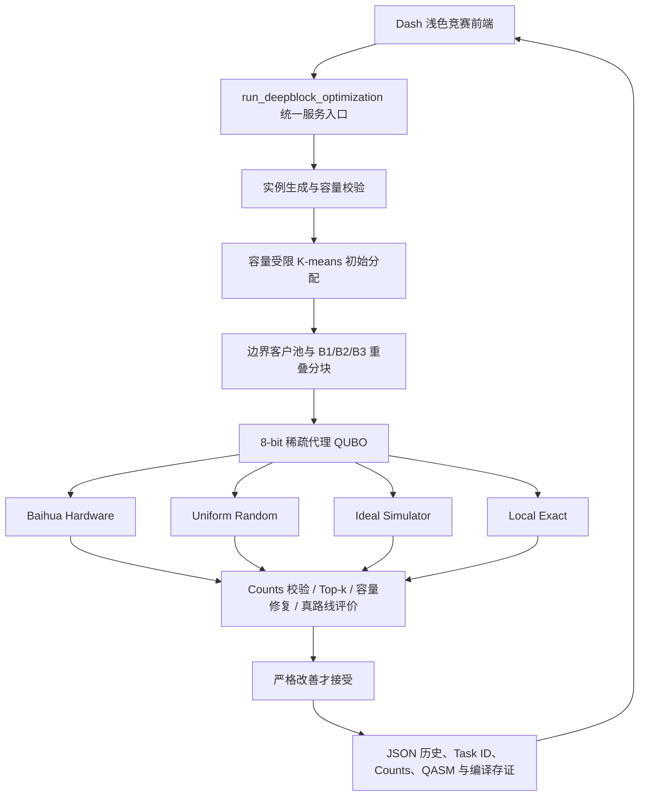

# Quantum Route Forge 项目完整文档

> 当前分支：`competition/deepblock-ui-integration`
>
> 文档日期：2026-08-02
>
> 项目仓库：`LPZ-SY/kujinganlai-version`

## 摘要

Quantum Route Forge 是我围绕“量子候选生成如何真正进入车辆路径优化闭环”设计和实现的混合量子计算项目。我没有将量子处理器包装成能够单独求解完整车辆路径问题的“黑盒”，而是把它放在一个可审计的候选生成位置：真机负责在局部 QUBO 状态空间中产生 bitstring 分布，经典端负责容量修复、真实路线评价、严格接受与结果存证。

在当前分支中，我进一步完成了 Baihua DeepBlock 竞赛前端、容量受限初始聚类、B1/B2/B3 重叠分块、8-bit 稀疏代理 QUBO、Baihua 校准拓扑编译、Hardware/Random/Simulator/Exact 同条件对照、Top-k 真路线评价、历史记录和完整证据展示。我已实际提交 3 个 Baihua 真机任务，每个任务 4096 shots，全部返回完整 counts。

我对结果采取边界清晰的表达：当前三区块 Baihua 真机对“预定义最低 10% QUBO 能量区域”呈现了正向富集，平均命中率为 22.9574%，均匀随机基线为 10.1562%，富集倍数为 2.2604×；但这次局部搜索没有产生更短的真实路线，路线距离保持 90.8199。这说明“低代理能量富集”和“端到端路线改善”是两个不同层次的命题，我在项目中对二者分别评价，不做超出数据的量子优势宣称。

## 1. 项目定位

我将本仓库作为 Quantum Route Forge 的唯一项目主线。我在这条主线上持续完成了问题建模、量子测量接入、经典候选评价、多后端正式实验、DeepBlock 局部搜索、竞赛可视化和证据审计。当前分支不是一个孤立的算法脚本，而是一套能够从参数输入、真机提交、结果轮询、候选解码、路线验证一直走到历史证据重载的端到端系统。

我为项目设定了三个核心目标：

1. 我要让真实量子硬件的 counts 进入路线优化业务闭环，而不只是停留在电路演示层。
2. 我要在相同实例、相同状态空间和相同后处理规则下评价 Hardware、Random、Simulator 和 Exact；其中三种采样 arm 锁定相同 shots，Exact 明确作为全状态枚举参考。
3. 我要保留包括不利结果在内的完整证据，并且严格区分真机、模拟器、回放、手工输入和 fallback。

## 2. 研究背景

### 2.1 车辆路径优化

车辆路径问题（Vehicle Routing Problem, VRP）广泛出现在城配物流、即时零售、制造配送、仓网调度、应急保障和公共服务中。在最基本的容量受限车辆路径问题（CVRP）中，我需要同时决定“客户分给哪辆车”和“每辆车以什么顺序访问客户”，并保证车辆载荷不超过容量。

这类问题的搜索空间会随客户数快速增长。在工程场景中，我还需要考虑需求量、容量、路线形状、局部拥挤、时间限制和运行可解释性。单一求解器很难同时兼顾搜索广度、约束满足、运行时间和审计需求。

### 2.2 NISQ 阶段的量子优化

当前真实量子处理器仍受限于可用比特数、物理连接拓扑、门保真度、电路深度、采样噪声和排队成本。我因此没有尝试把全部 40 个客户一次编码进真机，而是采用混合架构：经典端完成全局可行初始解和路线评价，量子端聚焦于不超过 8 个变量的局部重分配问题。

我对量子端的定位是“候选分布生成器”，而不是“结果真理机”。量子电路产生一组带频次的 bitstring，我再用与经典基线完全一致的解码、容量修复和真实路线评价器判断它是否有业务价值。

## 3. 行业痛点

### 3.1 组合爆炸与实时调度之间的矛盾

我观察到，物流调度不仅要追求更优解，还要在有限时间内持续返回可行解。随客户、车辆和业务约束增加，全局穷举不再现实，单一启发式方法又可能早早停在局部最优。

### 3.2 量子资源与业务规模不匹配

我不能直接把大规模 CVRP 完整映射到当前硬件。真机对比特数和两比特连接都有约束，额外 SWAP 会加深电路并放大噪声。如果忽略物理拓扑，一个逻辑上漂亮的 QUBO 也可能在编译后失去实验价值。

### 3.3 “低能”不等于“更短路线”

我在实验中特别重视这一点。QUBO 能量是局部代理目标，它可以保留某些距离和容量信息，但不能完全等价于“容量修复后、客户重排后的全局真实路线距离”。如果只报告低 QUBO 能量而不重新计算真实路线，很容易对业务效果产生误判。

### 3.4 对照不公平会放大虚假优势

如果 Hardware 使用更多 shots、更大 Top-k 或更强的后处理，而 Random 只得到少量候选，结果就无法归因。因此我在竞赛流程中锁定同一实例、同一初始分配、同一分块、同一 Top-k、同一修复器、同一路线评价器和同一接受规则。Hardware、Random 和 Simulator 锁定相同 shots；Exact 不伪装成同 shots 采样，而是明确枚举全部局部状态。

### 3.5 真机证据容易丢失或被混淆

一个能运行的演示并不等于一个可验证的实验。我需要保留 Task ID、请求后端、实际后端、shots 请求值与返回值、counts、QASM、bit order、客户顺序、编译审计和时间戳。我还必须防止 simulator、replay、manual 或 fallback 被误标为 hardware。

## 4. 总体技术方案

### 4.1 系统架构

我将系统拆成了界面层、编排层、经典初始化层、DeepBlock 局部建模层、量子执行层、候选评价层和证据存储层。



### 4.2 主要模块

| 模块 | 我在项目中赋予的职责 |
|---|---|
| `app.py` | 提供竞赛主页、参数输入、四页结果展示和真机确认门 |
| `app_research.py` | 保留原研究型多实验前端，与竞赛页独立运行 |
| `deepblock_service.py` | 统一生成实例、运行四种 arm、组装对照、计算量子效应并保存历史 |
| `deepblock/clustering.py` | 构造空间紧凑且容量可行的初始车辆分组 |
| `deepblock/builder.py` | 选择车辆对、边界客户池和 B1/B2/B3 重叠分块 |
| `deepblock/proxy_qubo.py` | 建立二次代理目标，进行物理拓扑边裁剪和系数归一化 |
| `deepblock/qaoa_runner.py` | 生成 QAOA QASM、理想模拟、Baihua 编译提交、结果轮询与编译审计 |
| `deepblock/evaluator.py` | 规范化 counts、评价 Top-k、修复容量并重算真实路线 |
| `competition_history.py` | 以独立 JSON 保存每次比赛运行，支持重新打开和表格摘要 |
| `candidate_quality.py` | 支持正式硬件候选质量门、随机参考和经典阈值评价 |
| `result_store.py` | 保存可恢复、可去重、可校验的正式实验证据 |

## 5. DeepBlock 核心算法

### 5.1 容量可行的初始分配

我首先用客户坐标和需求特征得到 K-means 几何中心，但我不直接使用普通 K-means 的 label，因为普通 K-means 不理解车辆容量。我将客户按需求和空间代价重新分配到车辆，并通过多个确定性/随机重启顺序寻找容量可行结果。这一阶段确保 DeepBlock 的输入本身是可执行的物流计划。

对每辆车的客户集合，我使用最近邻构造访问顺序，并使用统一路线距离计算器得到初始总距离。后续所有方法都从这一份不可变初始分配出发。

### 5.2 车辆对与边界客户池

我根据车辆路线区域中心的几何关系排序车辆对，选择最有可能通过重分配获得改善的两辆车。我从这两条路线中提取候选客户，边界得分综合考虑：

- 客户到另一条路线中心的距离；
- 客户到两车区域分界的距离；
- 客户需求量对容量的影响；
- 客户之间可保留的二次交互。

当前配置使用 16 个边界候选客户，再覆盖为最多 3 个局部分块。

### 5.3 B1/B2/B3 重叠分块

我将每个 DeepBlock 限制在最多 8 个客户，对应 8 个逻辑比特。相邻分块默认保留 3 个重叠客户，使不同局部问题之间保持一部分交互与信息传递。

对于一个包含 8 个客户的分块，每个二进制变量表示客户在所选两辆车之间的归属：

```text
x_i = 0  ->  客户 i 分配给左侧车辆
x_i = 1  ->  客户 i 分配给右侧车辆
```

因此一个 8-bit 分块包含 $2^8=256$ 个可枚举状态。局部 Exact 可以穷举这 256 个状态，但它不等于穷举完整 40 客户 CVRP。

### 5.4 稀疏代理 QUBO

我对每个分块构造二次无约束二进制目标：

$$
E(x)=c+\sum_i h_i x_i+\sum_{i<j}J_{ij}x_i x_j.
$$

其中，$h_i$ 描述单个客户从一辆车切换到另一辆车时的代理代价变化，$J_{ij}$ 描述两个客户同时切换时的交互代价。代理得分结合了局部路线距离和超载平方惩罚。

我不会将所有逻辑交互无条件保留。对于硬件 arm，我只保留与所选 Baihua 物理子图直接耦合兼容且系数足够大的二次边，并对系数归一化。这样可以在建模阶段就考虑硬件可实现性，减少后续额外 SWAP。

### 5.5 QAOA 候选生成

我为稀疏 QUBO 生成 QAOA 逻辑 QASM，并支持 $p=1,2,3$ 的电路深度。竞赛流程会在经典端预训练 QAOA 参数，相邻分块之间可以传递同深度的 gamma 和 beta 初值。

量子电路的输出不是一个唯一解，而是 counts 分布。例如：

```text
01011001 -> 147 counts
11001001 -> 121 counts
...
```

每个 bitstring 对应一个客户重分配方案。我保留完整 counts，不只取最高频单样本，因为低频但优质的候选也可能对路线有价值。

### 5.6 四种候选来源

| 模式 | 我在系统中的定义 | 主要用途 |
|---|---|---|
| `Baihua Hardware` | 编译后提交到 Baihua 真机并轮询真实 counts | 评价真实硬件候选分布 |
| `Uniform Random` | 在相同 $2^n$ 状态空间中均匀随机采样 | 提供最基本的同 shots 参考 |
| `Ideal Simulator` | 无噪声状态向量 QAOA 概率采样 | 分离理想电路能力和硬件噪声 |
| `Local Exact` | 穷举当前局部分块的全部 bitstring | 判断当前局部邻域是否真的存在改善 |

### 5.7 Top-k、容量修复与真路线评价

我对 counts 做 bit-order 规范化和 shots 校验，然后选择最高频 Top-k 候选。每个候选都经历以下流程：

1. 我把 bitstring 解码为两车之间的客户分配。
2. 如果出现超载，我记录修复过程并进行容量可行修复。
3. 我用和基线完全相同的路线构造与距离函数计算真实总距离。
4. 我只在候选容量可行且真实总距离严格小于当前距离时接受。

我不接受“距离相等”的移动，也不用 QUBO 代理能量替代最终路线距离。这一设计保证最终页面上的每一次“改善”都可以在真实路线评价器中重算。

## 6. Baihua 真机集成

### 6.1 提交安全门

我将 Hardware 默认设计为 guarded dry-run。用户必须在页面中显式选择 `Baihua Hardware`，再勾选“我确认”，系统才会提交最多 3 个真机任务。没有确认时，Hardware arm 只进行编译预检并返回 `NOT_EVALUABLE`。

如果 token 为空、编译失败、结果超时或 counts 不完整，我会将 Hardware 标记为 `FAILED` 或 `NOT_EVALUABLE`，不会悄悄使用 Exact 或 Simulator 代替真机结果。

### 6.2 校准拓扑与物理编译

在真机提交前，我从 Baihua backend 获取当前 chip information，选择适合 8-bit QUBO 的校准子图，然后将逻辑 QASM 映射到目标物理比特。当前 3-block 预检选中的物理比特为：

```text
[41, 28, 29, 30, 17, 16, 15, 14]
```

当次预检的直接耦合平均保真度为 0.987714，三个分块的物理电路深度均为 29，编译审计记录为 0 SWAP。我对映射完整性、未校准耦合、CNOT 数量和电路深度进行了提交前审计。

### 6.3 结果轮询与 counts 验证

真机提交后，我立即记录 Task ID，然后轮询任务状态。对于完成任务，我验证：

- counts 键只包含合法的 `0/1` bitstring；
- bitstring 长度与当前 DeepBlock 宽度一致；
- counts 总和等于返回 shots；
- 请求后端与实际后端一致；
- 任务状态是真正的 `COMPLETED/Finished`。

本次 3 个真机任务的 counts 总和都是 4096，未使用任何伪造或补齐样本。

## 7. 公平对照与证据模型

### 7.1 竞赛分支的公平性锁定

在同一次竞赛运行中，我对 Hardware、Random、Simulator 和 Exact 锁定以下条件：

| 锁定项 | 目的 |
|---|---|
| 相同客户、坐标、需求和 Seed | 避免实例差异 |
| 相同容量可行初始分配 | 避免起点差异 |
| 相同车辆对和 B1/B2/B3 | 避免搜索邻域差异 |
| Hardware / Random / Simulator 使用相同 shots | 避免三种采样来源的预算差异 |
| 相同 Top-k | 避免真路线评价预算差异 |
| 相同容量修复器 | 避免后处理差异 |
| 相同路线评价器 | 使最终距离可直接比较 |
| 相同严格接受规则 | 避免为任意方法放宽标准 |

Exact 是局部全枚举诊断 arm，它不是与其他三个 arm 同 shots 的采样器。我用它回答“当前分块的全部状态中是否存在更短可行路线”，而不用它声称同采样预算性能。

### 7.2 测量来源与完整存证

我的统一测量模型保留 `hardware`、`simulator`、`replay`、`manual_debug` 和 `fallback` 等来源。正式硬件统计只接受已完成、后端一致、完整 counts 且证据可定址的 hardware 记录。回放数据可以用于离线验证，但我不会把它标成新鲜真机数据。

我在正式 result store 中保留 config hash、阈值文件 hash、QASM hash、客户比特顺序、任务状态、依赖版本、编译参数和去敏原始响应。我的批处理流程按任务立即写入，支持中断恢复和 config hash 去重。

## 8. 实验设置

### 8.1 实验 A：24 任务多后端正式候选质量实验

我使用预先冻结的 `formal-matrix-v2` 协议运行了一组平衡正式矩阵׏}����k�w��{�"�
��)���B�́E=����:�ң�<����������)�������ے�w�Vg�j����j?�r���"����ꘀ���ؔ��(+�"G����g�⫞�O�zs�j�����Úb���i	���Մ����ߖr�����&�B�EU	<���+��禊��k��'��;���2�F#�:Ú���BG��3�n�����7��������?�f7��8�ȸ�̃�7��3����7������޿�����~��ȸ�̃�7��n����b#��>C��^ۖ�?�j�:�n���3�"G��7�r�����&�ZÞj���Σ�3�����ے��*��v���3�"C���������3���((�����̃��O�&4�̵������	���Մ��r�r���ߞ�O�zp(+��O�&7��C��0�%���聀��������P������h��͉��є݃���'�⨁	���Մ����*�������3�"C��h()��	�������Q�ͬ�%���M���́���R�����O������;���F��ⴁ�������ۚ��:����j?�r뚚�:�����3�n�7�V���)𴴵𴴵𴴴�𴴴�𴴴�𴴴�𴴴�𴴴��)��ā���������������������̀������؁����؁���������и���ؔ���������Ȕ���ĸ����\��)��ȁ���������������������Հ������؁����Ё����ȁ���̸���ؔ���������Ȕ���ȸ����\��)��́���������������������݀������؁����́�����ā��������䔁��������Ȕ���ȸ����\��)������ϖv�����́хͭ́�����Ȱ��ਨ����P����P������ȸ���Д�������������Ȕ�������ȸ����\����(+��'�⫖"�v_�j��;���F��ⷚ��:����c��;�v�2�j?�r�~�����3��ϖv��w��疊{�*�����ȸ���ă�⫞f��"�
��"G�n�����*+��g����͵�����j�g�'�"����O��뚂��Ò�聁��ͥѥٕ}���}���ɝ�}��ɥ�����у�((�����Ѓ��O�&4�̵�������j�޿�����O�zp(+�f��ے�;���2떾3�n��뚶���3����O����޿����ʇ�r'�R�Z��h()���2�������O�zp��)𴴵𴴴��)���"w��/��w���������������܁�)���r��#��w���������������܁�)���R�Z���������������)���R�Z�:����������)���:��>_���*�������(+�r�r�Q����Ѓ�ⷾ�1ă�j�r����r��{�޿�������ĸ�������۾�1ȃ����ȸ���������3����S��O�&7�޿����nӖ޻��m̃�j�r�����������������߾�3��;��O�&7�޿����n㞶'��3�n����"G�j�:��>_���"g�����◚��>c�~���3�&������.K��w�(+�B3����{��/��+��1!�ɑ݅ɗ�I������M��ձ�ѽȃ�J0�1�����ᅍЃ�����s�r������������߾�3�:��>_����VÖ������Î	1�����ᅍЃ��˞�?�zk�������?�⨀൉�Ѓ�"�v_�j�������؃�⫞*ۚ��3�&�"G�>���������k�r���O�&7��������J0�ĽȽ̃�&��k��'�j�����
�~�ⷾ�3�ʇ�r'�◚��nӞ~��j�>���3�޿������g��7�����b;��3�VЀ�������"ߦ^���c��˞�?����"Ö����r��c��3����Ӛb;��O����s�^��R�Z�w��7�b��RǞr�r��?����⫖�˞~������nӒ�c�*ۚ�6W�.����"C�j�((�����ԃ�ⓞ�{��3������#��7�~o�n�((�Ѓ���*������?�~��bמj�E!H��^���o���{��/��Rע޿��>�VÖJ3�B;����6?�����3��8����	������r��8��������?�����{��3��7�n�B3��&7����~����O��w���ң�?�2�~�J3��?��b#���3�B;����~��B3���൉�Ѓ�B�EU	<��j�n㖾���?�����"G��7�*+�ⓞ��f��"��S�nӚ:���S����3����7�R�������O�zs���n[�>�������O�zs�(+�"G��O�&7�j���B#��O���b���h((���"G��˞�?���b;�����>��*+�r�r聍�չ�̃��3�Vӎ�>��������râ�O���޿�����c�2[�^��:��(���"G�r����"����	������B�EU	<���+�����"Ò�����BG��;���2떾3�n�(���"G�ʇ�r'�r���Ѓ���*������?�~��bגⷢ����"Þ�ϖ�k����BG�g�'�ң�?�V#��S�(���"G��k�r���랮/�����۞n㖾�j?�r�"[��?��Z��W�j�޿����Ꟛb��F_��c�*��(���"G��7�����æk�R��?��C��c�*���?��C�*���"[�꿦?��C��3�VЁ
YI@�������((�������]����&7����*��((�������ă�������:�"d(+�"G����{��o�&7��������������&˞���3����R����Nw��f��&ˎ��G�?�ү�&˖J3����&˒�s���*ۚ�&ˎ�"G��ꛚR����������Z�����6W��2���6��J3��מ����_��O��3�����צv��nӦ�B#��S��o��S���J3�V��^ۦ^Ӧb���(+��צv���ۦ��>C��o��/�>�Vþ�h()���>�V�����B���$��)𴴵𴴵�)������"ߚV�����R�"C�j�7�����"ߚV���)��������V�����>��R�������V���)����������<�����?������j�r����+�f@��)��M�����������{��/�J3�j?�r聅ɴ��>��7�:���)����C��3�����<���!�ɑ݅ɔ���I��������M��ձ�ѽȀ��ᅍЁ�)��	����������r�r�B;�����3��O�&7���	���Մ��)��M���́����?�⨁���	������j���ߚV���)��Q���������o���r�޿�������ߞj��c��G�g�'�V���)��E=����Ѡ���E=����V�������((�������ȃ�no�⫦�מ��((������ă�޿�����c�2X(+�"G�r������ז�W���"w��/��w����r��#��w����R�Z�?��R�Z�:��:��>_���*�����VÎ��O�zs�v���C�J3��C��3�*ۚ��ⓖ��޿����n���ۚ:K�b���떺�?�>_�fC�"w��/�޿����J0����	������r��#�޿�����3��W��������"_�뚾?������j����"ߦ���?�����6ߎ���?�J3��w���((������ȁ���	���������,(+�"G�r������ז�W���ĽȽ̃�j����"ߎ����������S�&疺��ꛎE=���ǖꛎQ�ͬ�%�	���������S�nx�͡��ώ�:��>_����_�J3�Ϟ�[�:�n��	Q������������o�������W��聉����ɥ�����չӎ���:�EU	<��B���?������7�&7�B;�>���3��������7��Ӛb;�J3�r��{�޿�����w����"G���>C��o�>���W���j��3�VЁ��չ�ώ���D�EM7��&��B�EM4��J3��[��G�������((������̃�Z��W��皾P(+�"G�R��r��#�޿�����w���~Ǟ*ۖn��J0����	������&��>?�n˞����皾P�%��ѥ���!�ɑ݅ɗ�I������M��ձ�ѽȃ�J0�ᅍӎ��צv���ۦ���k�b�������Ϛ��R��k�*ۚ��3������"g��W��뚾?��7�Z��W�j�ͽ�ɍ���х��ώ���������х�������ɽٕ���ӎ�����ѕ����ٕ̃�J0�Q�ͬ�%ώ((������Ѓ��C��3�:�>�(+�"G��뚾?�����C��3��w��c�.���,�)M=;��3��ۖr��:�>˦�ך>C��o��������/�.'�'�.���"ߚZÖJ3�7�ZÚ&O�����/�.'�'������R��ҟ�G�6W��3����?��h()���ѕ��(���Ȁ�������!�ɑ݅ɔ���%1����э��Ɉ�(���Ȁ����ԁ��!�ɑ݅ɔ���
=5A1Q����͉��є�)���(+�"G���UQ��^ۦ^Ӣ���6����2_�곚^ۦ^Ӿ�3��ۖr��'���ⷞnӚ:��b���聵�����х��̃�J3�~��Iո�%��3���7��3�VЁ%M<��^ۦ^Ӓ�;�V��%��r�����/�.'�>s�6W�ⷚ6���3�7�>��((����ĸ���'����;��C��0((�����ĸă�:���(+�"G��O�&7��3���j���:����b��A�ѡ���̸�ˎ��'���F�����/��h()�����ݕ�͡���)��ѡ������ٕ�؀�ٕ��(�p�ٕ��qM�ɥ���q�ѥمє����)��ѡ�������������х����ȁɕ�եɕ����̹���)��ѡ��������ѕ�Ѐ��)���(+����w��[�2�.���͠�̹�A��ѱ�ع�9յA�͍���е���ɻ����������Յ�Ԁ��и׎�Յɭ��Ց���̸ܸ䃖J0��Յɭ��ɍեЀ��Ը�ώ((�����ĸȃ�B��*���{��o�&7���()�����ݕ�͡���(�p�ٕ��qM�ɥ���q��ѡ����ᔁ�����䀴����Ѐ��ܸ����Ā�����Ѐ����)���(+�&O����h()���ѕ��)����輼��ܸ����������)���((�����ĸ̃�B��*���w�Vg�j��S��ۖ&7���()�����ݕ�͡���(�p�ٕ��qM�ɥ���q��ѡ����ᔁ���}ɕ͕�ɍ���䀴����Ѐ��ܸ����Ā�����Ѐ����)���(+�&O����h()���ѕ��)����輼��ܸ����������)���((�����ĸЃ��'���~��r/�:Úr'�r�r��O�zp(+���zs�"G�>��r���~��r/��˖�3�"C�j�̵�������r�r��O�zs��3�"G��7�r���7����
��!�ɑ݅ɔ���C��3��"G�>���o���p�Ѓ��C��3�:�>ˊw��3�'�.��~��%���͉��є݃��3�
��s�7�ZÚ&O���w��3�ۖB;�"�6��"���ļ�ȼ�̃��ך~��r/�޿�����"�v_���6��J3�Z��W��皾S�(+��צv���ۦ���O����������s��/�����������C��3�j�>�VÊw��3����7��k�r��&O���:�>˖B;���*����n[���:�>˖��"G��k�:�>ˢ����ⷢ�Ö�W�j���Ʌ��ѕ�̃��s����O�����{��3�r��{�������((�����ĸԃ�r�r��C��0(+�r�r뚢���?�r���r���O�&7��o��/�:����ⷚ>C��l��EUU}A%}Q=-9���"G��7��k���ѽ�����g���:�>ȁ)M=;���{��3���6��"X��Ѓ��O��O��'�.��!�ɑ݅ɔ���ۖ.��'���������B;��3��?����
����>����>C�ꓚZÞj�	���Մ����*���3�n�����"G�>��r��b;����r���ZÚVÚ6��^ۚ&���3����N7��s�((����ȸ���/��W��>���7�:Ú���;�ң�?��w��(+�"G����/�ϦR��޿����[�g��������6W���/��W�J3�n�"C��/��W��h((�������ɥ�����8�=���EM4���չ�̃�j��c��;��7����?��l(����չ�̃���2�2[��v{��W�R��.K��w�J0�͡��̃��J3��3����l(��ĽȽ̃�7�>����n[�J3�&��>?����?��l(��EU	<����?��;�*ۚ��[�������l(�����?�����7�B;�j�>���3����l(��Q������g�'�j�r��{�޿�������߾�l(���◚��>c�~��:��>_���"g��l(�������ᅍЃ�zk����>���l(��!�ɑ݅ɔ�����ո���;�b���?�������^���l(���:�>ȁ)M=8���w��c��7�����;�ҟ�G��/�.'�'����l(���r��8��������?�2�~�n떺k�:K�B7�����_��l(����k�B;��������<�ɕ�ձЁ�ѽɔ��j��3�VӚ���:�7�J3�v���C��3����l(��]�����מ�����O��Væ?�J3�����ے�w�*��:���ێ(+�"G�j�����?��{��3�6?�������R����O�7�����b#�����ͣ�EM4���͠��J3����"ߦ���<���ͣ���?�⫒��*�����R��R�������������ͣ��3�&疒�B����7�^ے�7��k�7��7�>C�ꓖ�˖�3�"C���*��((����̸���O��O��O�z()���ѕ��)EՅ��մ�I��є��ɝ��)𴴁������)������{��o���&7�����k�޿�������	���������/��Z��W��皾S���C��3�:�>�)𴴁���}ɕ͕�ɍ����)������w�Vg�j��S��ۖ�{��3�&7���)𴴁�չ}������)�����6W�����?�࿦?��C����,�
1$)𴴁ɕ�եɕ����̹���)𴴁�Ɍ��Յ��յ}ɽ�ѕ}��ɝ��)����𴴁���������}͕�٥�����)����𴴁�����ѥѥ��}���ѽ����)����𴴁�������ѕ}�Յ������)����𴴁�Յ��յ}�����ɕ����̹��)����𴴁ɕ�ձ�}�ѽɔ���)����𴴁�����������)����𴴁ɽ�ѥ�����)����𴴁͍���ɥ����)������������������)��������𴴁����ѕ�̹��)��������𴴁�ե���ȹ��)��������𴴁����ѕɥ�����)��������𴴁�م�Յѽȹ��)��������𴴁�ɽ��}�Չ����)��������𴴁Ņ��}�չ��ȹ��)������������ͽ�ٕȹ��)𴴁����ɥ����̼)����𴴁��э�}�������ѕ}�Յ������)����𴴁�չ}�Յɭ��Ց��}�������ѕ}�Յ������)����𴴁م����ѕ}��ɵ��}ɕ�ձ�}�ѽɔ���)����𴴁�ɕ��ɕ}��ɥ�}����й��)����𴴁��ɥ�}����ɥ��ѥ�����)����𴴁����Ʌѕ}�����}��ѥ����̹��)��������������̼)��������������ɵ��}��ɑ݅ɕ}���ɥ�}�ȹ�ͽ�)𴴁ɕ�ձ�̼)����𴴁�����ѥѥ��}���ѽ��)����𴴁����ɥ����̼)���������Յɭ��Ց��}�������ѕ}�Յ����}م����ѕ��)𴴁���̼)����𴴁��ɵ��}����ɥ����}�ɽѽ������)����𴴁��ɵ��|��}хͭ}ɕ���й��)����𴴁��ɥ�}����ɥ��ѥ��}ɕ���й��)����𴴁�Յ��յ}������}�٥��������)��������EՅ��յ}I��ѕ}�ɝ����n���3�VӚZ������)����ѕ��̼)���((����и���˞~����f@(+�"G����O�&7�����j���*o���V3�k����/�fC��k��h((ĸ������	������b������Bs�ҋ�����"G��O�&7�'�.�����������J3�r��k��'�⨀൉�Ѓ�"�v_��3�n�����1�����ᅍЃ����7�b������
YI@�����������(ȸ���EU	<��b��B����z/�����"G��w�Vg�j��3����ꓒ�K�>_�����ۚ.O�&G�fC�"۾�3��;�B���?��7���ۢ���2[���nӞ~��r��{�޿����(̸�����O�&4�̵��������ߚr���#��?����̃�⫖"�v_��c�b��7�>��j��3�"G��7�*(�̼̃�bϚ���O�"C��"�j������b��F_�����6��(и���ȸ��\���{��;�:��ҋ���>��������"G��˖��O����^���o��3����7�r���ZÞj���Σ�3�����ۚ&皲��(Ը��������<��Ѓ���*��~��bע2�nӚr'�fC������O���>���R���;�����/��{��/��Rע޿��>�VÎ��[��G��������B;����J3�&���3�^��r�(ظ����"G��k�r����b;�?��C��ꛒ�c�*�������O�&7���n��j�7�
�b��g�'�ң�?��޿����҇�2��J3�>�����������3��7�b��݅����������*���(ܸ����r��r���͠��r7�*��f���7�b��R�꟦���ˎ�����O�&7��צv��R���;��S��ێ��{��o�J3�r��rÚ�S����3��k�r��7����R�꜁]M'���������k�R��"ߒ��*��jS���J3�2���VÚ6���O�((����Ը��B;����"H(+�"G��릆�n������k����/��c�#�ꟾ�h((�����Ըă���Σ�3�r��8������������{��0(+�"G���r����>[�ZÞ����؁��չ�̃��/�&7���O��{��/�EU	?����?�b#��͡��ώ͕����Væ?����2���J3���������3��ZÚ&皲�����;�^��r|�ȸ��\����6���3���"���*��F+�((�����Ըȃ�&���W�����
�~|(+�"G����"K��;�s�6W�������䀬�ĽȽ̃�6W����w�&���W�"Ö�k�������������S���V3�ƃ��&7�BD��>7�BG�&��>?�J3��k����◚��R�Z��"G��k��w�Vg��?����j��w���6W����7��{��w���((�����Ը̃�>C��`�EU	<���;�r�޿����j�:K�B7�n�Ϛ�(+�"G���R������ᅍЃ�VÚ6��?�2[�s�B���?�:K�B7�w��;�s�����7�B;�r�޿�����w���:K�B7�w�j�M���ɵ���-��������n�Ϛ���3��ۦJ#���.O�&G���&�����?����k�J3�޿����B���VÖk��#�z7��{��3�((�����ԸЃ�?��C�>�VÒ�;�����ۦ���K��(+�"G����S������İȰ̓��>�Vâ������k����������"w��J3��7�B3������C�n���3�B3�^ۢ�Ö�W�Rע޿��ǖꛎ�ⓚ�S�&�^��VÎM]C���w�r�ꛒ�;��;����3�n��/�^Ӟj�Ϟ��((�����Ըԃ��;�r��rÚ�S����#�BG�R�Ꟗ���(+�"G����"K���V��^ۦ^Ӟr�r���*���8��͠��n{���ⷚ.�"���B;�>Ò�s��k��3��{�*����*��b�"_���o�ꛚ~������VÚ6���O�:�>ˎ�R��"ߚv�fC����J��&c����J3�R�꟞Ꟛr7�*��f��((����ظ��>�����j��O����;��7����j��O���((�����ظă�"G��O�&7����j��O���((���"G��˖�{�:Ò���_�>��������j�	���Մ���������M����������r�r�g�'�ң�?��{��3����/�(���"G��˖�{�:��	���Մ����	�������;�����.O�&G��[��G�"â޿����◚��:��>_�j����"Þ���r�r�^��:��(���r���O�&4�̵������͵�����ⷾ�1	���Մ����r��8������B�EU	<����?�2�~�j��ϖv���:�ң�?�b��v�2�j?�r�j�ȸ����_�(���r��^��r|�ص͕����:��ҋ�ⷾ�3�n�B3�>����j��3�n�7�VÚb��ȸ��_��3���r���ZÞj���Σ�3��{��3�������(���r���O�&4�̵��������{��/�ⷾ�3�����ᅍЃ���b;�&�'�
�~��ʇ�r'�◚��nӞ~��޿����(���r���Ѓ���*������?�~��bגⷾ�3�"G�ʇ�r'�����"Þ�ϖ�k����BG�g�'�ң�?�"[�޿����҇�2��((�����ظȃ�"G��O�&7��7��k�k�j��O���((���"G��7�����Úr����n���˞�?��{�:æk�R��?��C��c�*��(���"G��7�����Ö�˞�?���b;�?��@�݅����������*���(���"G��7���ȸ��\��"X�ȸ����\�����+���޿�����w���R�Z�7�VÎ(���"G��7�������൉�ЁᅍЃ����+��떺3�VЁ
YI@������r��c����(���"G��7�����⨁͡�Ѓ��O�"C������.���/�����ۦ7��7�(���"G��7���ɕ�������Յ��ͥ�ձ�ѽȃ�"X�����������K��ZÞj���ɑ݅ɔ����6��(���"G��7�jC�^?�����?�6?����ⷖ��?��C�Z��W��7�"��j���*��((����ܸ����L(+�"G�r��EՅ��մ�I��є��ɝ���ⷢ���Ϟj��7�>��b��s�;��#���R�������?��C�r�r�w��3�3�b�����W�*+�?��C���ߚR���o���⫖���ώ�>������7��>��7��_��>���c���j�޿�����c�2[�^��:����O�&7�"�R���˞�?����g����S��۞n�������2[�"C�>��ꓒ�K�j��{��o�&7����J3��{�f�>���C��3�j�	���Մ����	���������/�(+��O�&7�VÚ6���g������⫚r'������j��O����k�"G�r����"����	������B�EU	<���+�r/�"Ò������ے�;����3�n��3����c�ʇ�r'������ϖ�k����2[�"C�n㖾�j?�r�"[��?��Z��W�j�޿����꟒�c�*����g���޻��w�b;�������/���bۚ�מj��S��ۦ7�
��k�&���W�����
�~��>C��`�EU	<���;�r�޿����j�n�Ϛ����3�"C���Σ�3�������{��3��3��۞�w�Vg�&�r'�r'�"���;��7�"����6��((����f��T���k�ϦR����6��޿��()�����6������O��O�޿����)𴴵𴴵�)���Ѓ���*������?�6?����������̽��ɵ��}����ɥ����}�ɽѽ���������)���Ѓ���*��C���*��*��F(�������̽��ɵ��|��}хͭ}ɕ���й�����)����H��D�����Ϛ�ߖB#�*��F(�������̽��ɥ�}����ɥ��ѥ��}ɕ���й�����)���?��C�V#��S���V0�������̽�Յ��յ}������}�٥�����������)�����Z��Úb;���V0�������̽�����}�����}��չ��ɥ�̹�����)����{��o�:�>ȁ���ɕ�ձ�̽�����ѥѥ��}���ѽ�佃��#�r��râ�C��3�n���W��3��c�����7�j<��Ѓ�>C�꓾�$��)�������?��{��0�ɕ�ձЁ�ѽɔ����ɕ�ձ�̽����ɥ����̽�ə}��ɵ��}��ɑ݅ɕ}���ɥ�}�Ƚ���)����{��o�&7������������倁�)�����	����������r7�*������Ɍ��Յ��յ}ɽ�ѕ}��ɝ�����������}͕�٥����倁�)�����	�����������{�:������Ɍ��Յ��յ}ɽ�ѕ}��ɝ���������������((����f��T���k��O�&4�̵�������r�r���*�()���ѕ��)Ā�хͭ}���������������������̀���������	���Մ��͡�������؀��х�������͡��)Ȁ�хͭ}���������������������Ԁ���������	���Մ��͡�������؀��х�������͡��)̀�хͭ}���������������������܀���������	���Մ��͡�������؀��х�������͡��)���((����f��T���k�r�������()���r��������r����n��ⷞj�B���$��)𴴵𴴵�)��EU	<�����3����^��ꛚv��3��o�"ے�c�2[����z,��)��E=����?��C��G����c�2[��_��W��3�r��r����n��ⷞR���;�R�"C�g�'�"����)�����	���������;���������޿����^���c�ⷚ*��>[�j�����ⓢ���7�"�7��C�^���`��)��
�չ�́���?��C��/�<������ɥ����"Ö�:Ú���VÞj�b�����)��M���́���B3���Rע޿�j��/�?���ߚ���V���)��Q���������o����?��r�޿�������ߞj��c��G�g�'�Væ<��)��Aɽ�䁕��ɝ��������EU	<��B���?��3��7��'��;�r��#�r�޿�����w����)��1�ܵ���ɝ䁕�ɥ�����Ё���r�r�"����o������k��'��;���2�j���:�n㖾�v�2�j?�r�j�>C��`��)��1�����ᅍЁ���zk����6W�⨁���	������*ۚ���^Ӿ�3��7�b������
YI@��������������)���9=Q}Y1U	1�����ʇ�r'��ϖ��j�B#����6���o��3��O�&7����܁�)��M�ɥ�Ё�����х�������>��:��>_���?�>���3��S�r��{�޿�����w���◚��?��?�j�g�$��